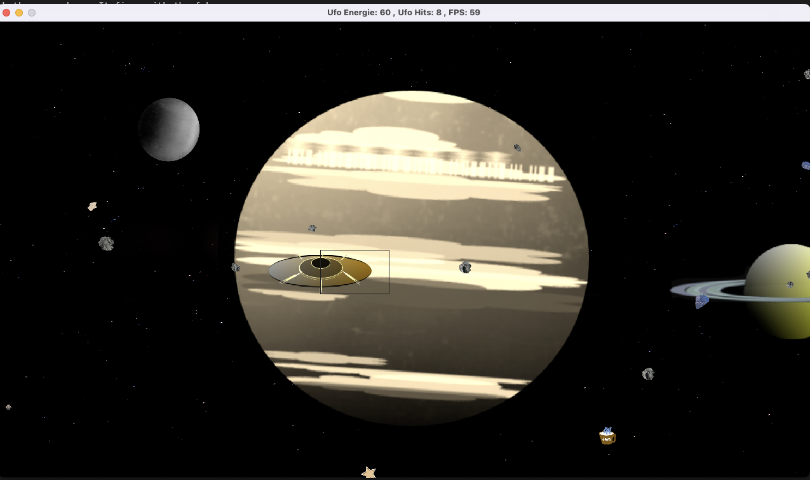

# CppND-Capstone-Asteroid-Game

This program uses the SDL 2 library. SDL 2.0 is distributed under the zlib license. This license allows you to use SDL freely in any software.

# Build the Project
- move to the build directory and use "cmake .." to build the makefiles.
- use "make" to compile the source code and link the project.
- use "./AsteroidGame" to run the project.

# Description of the project
The program is a video game. The program architecture consists of an initialisation part. Then follows the game loop with input controller, game update and rendering.
The storyboard is like follows: An alien spacecraft drives through a solar system on its way home, while it has to cross a field of asteroids and other celestrial bodies.
Hereby some *.bmp files are read and stored into textures, which are the animated on the screen.
Each hit by an asteroid costs the ufo energie points. But there is the possibility to gain again energie by firing on the fuelcanns, cups of coffee and cinnamon stars, which come with the asteroids.
The game is over, when the ufo has reached the last planet of the solar system or if it runs out of energy. The remaining energy points are the game score.

# File and class structure:
main.cpp - main modul
controller.cpp/h - keyboard input handling
game.cpp/h - initialization and control of the game loop
renderer.cpp/h - rendering the video output
ufo.cpp/h - class for the spacecraft
celestrial_body.cpp/h - class for the planets
asteroid.cpp/h - derived class from celestrial-body. It is used for the handling of the asteroids and bonus bodies.

# User Inouts
The ufo moves up and down with the arrow keys. It fires with the f-key.

# Adressed rubric points
# Compiling and testing
- The submission must compiles and runs
# Loops, Functions, I/O
- The project demonstrates an understanding of C++ functions and control structures.
- The project reads data from files and process the data,.
- The project accepts user input and processes the input.
# Object Oriented Programming#
- The project uses Object Oriented Programming techniques.
- Classes use appropriate access specifiers for class members.
- Class constructors utilize member initialization lists.
- Classes abstract implementation details from their interfaces.
- Classes encapsulate behavior.
- Classes follow an appropriate inheritance hierarchy.
- Derived class functions override virtual base class functions.
# Memory Management
- The project makes use of references in function declarations.
- The project uses destructors appropriately.
- The project uses scope / Resource Acquisition Is Initialization (RAII) where appropriate.
- The project uses smart pointers (The SDL-textures from the SDL lib are raw pointers. They cannot be avoided.
