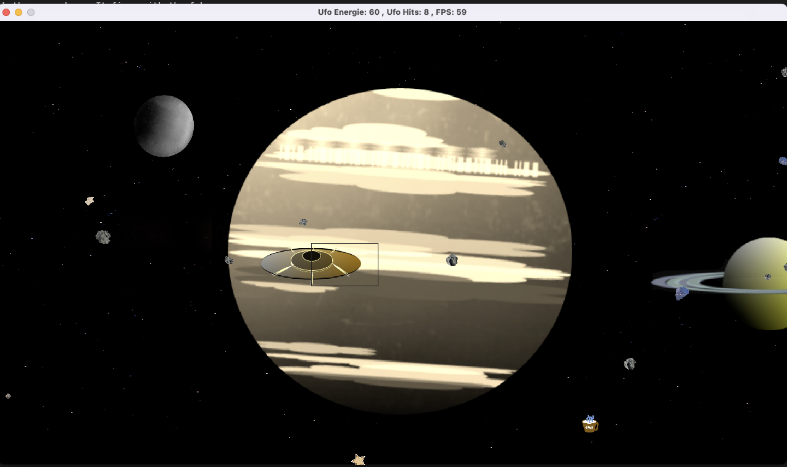

# CppND-Capstone-Asteroid-Game

This program uses the SDL 2 library. SDL 2.0 is distributed under the zlib license. This license allows you to use SDL freely in any software.

Purpose of this game: An alien spacecraft drives through a solar system on its way home.
But first, it has to cross a field of asteroids and other celestrial bodies.
Each hit by an asteroid costs ufo energie. But there is the possibility to gain energie by firing on the fuelcanns, cups of coffee and cinnamon stars, which come with the asteroids.
The game is over, when the ufo reaches the last planet. The game score is the remaining energy.

The ufo moves up and down with the arrow keys. It fires with the f-key.

